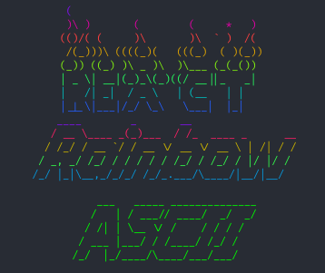

# react-rainbow-ascii 🌈

> A React component for generating responsive rainbow ASCII art from text



[](https://www.npmjs.com/package/react-rainbow-ascii)

## Install

With npm:

```bash
npm install --save react-rainbow-ascii
```

With yarn:

```bash
yarn add react-rainbow-ascii
```

## Usage

```jsx
import React from 'react'
import ASCII from 'react-rainbow-ascii'

function YourComponent() {
  return (
    <div>
      <ASCII text='ASCII + Rainbows!' />
    </div>
  )
}
```

Result:


### Options

You can pass several options to `react-rainbow-ascii` as props;

```tsx
interface ASCIIProps {
  text?: string // The text you want to render to ASCII. Default: 'Hello!'
  rainbow?: boolean // Whether you want the ASCII to be a rainbow. Default: true
  fallback?: string // Fallback HTML element to use for SEO. Default: 'pre'
  font?: figlet.Fonts // ASCII Figlet Font to use. Default: Slant
  id?: string // A unique id prevents multiple instances from conflicting. Default: null
}
```

See [examples](examples.md) for advanced usage.

## Development

If you want to make changes to this library in a local development environment,
first you need to symlink some packages:

```bash
cd ../your-app/node_modules/react && yarn link
cd react-rainbow-ascii && yarn link && yarn link react
cd ../your-app && yarn link react-rainbow-ascii
```

This allows you to see changes to this package immediately in your example app
and prevents the example app from seeing more than one copy of React.

Then start the dev server which will build the module and watch for changes to
automatically rebuild:

```bash
cd react-rainbow-ascii && yarn start
```

Then add `import ASCII from 'react-rainbow-ascii';` to your example project to use it.

To run tests:

```bash
cd react-rainbow-ascii && yarn test
```

Or:

```bash
cd react-rainbow && yarn test:watch
```
